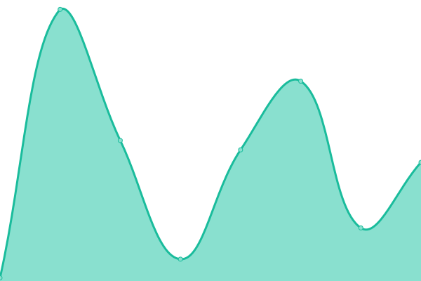
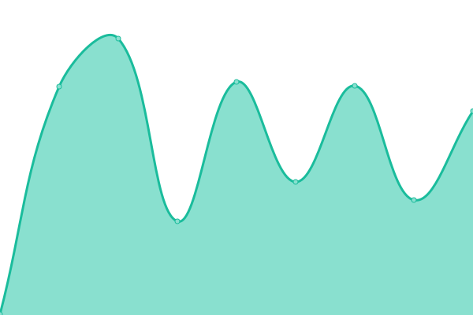
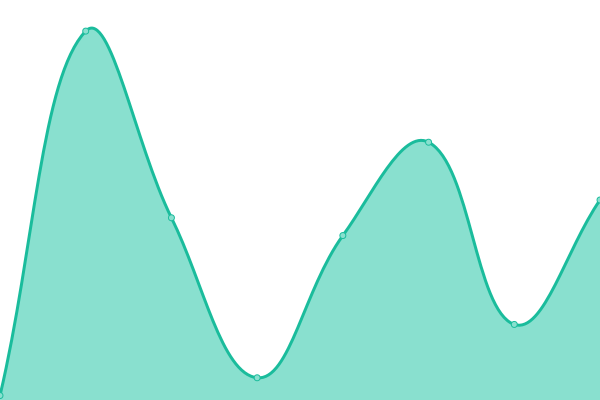
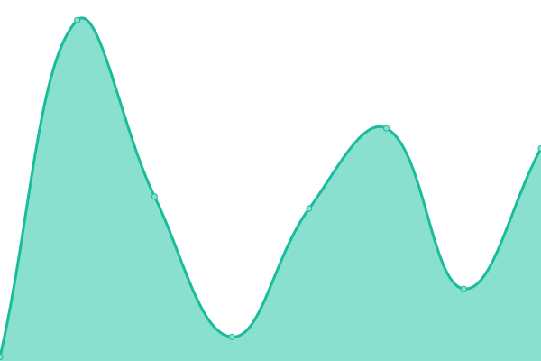
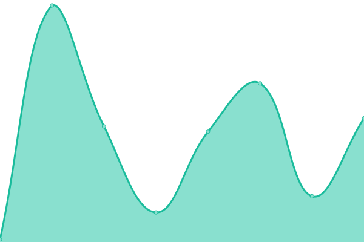
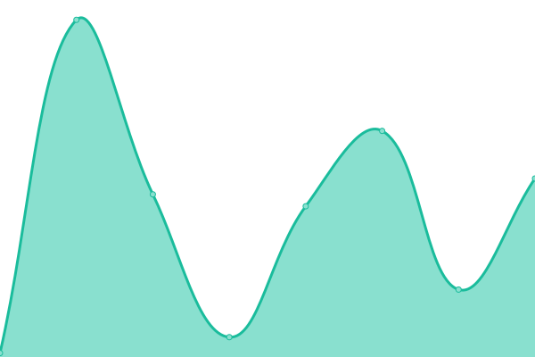
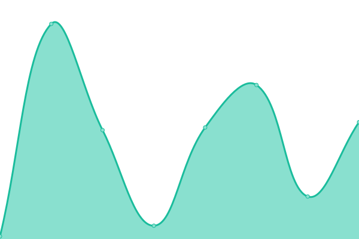
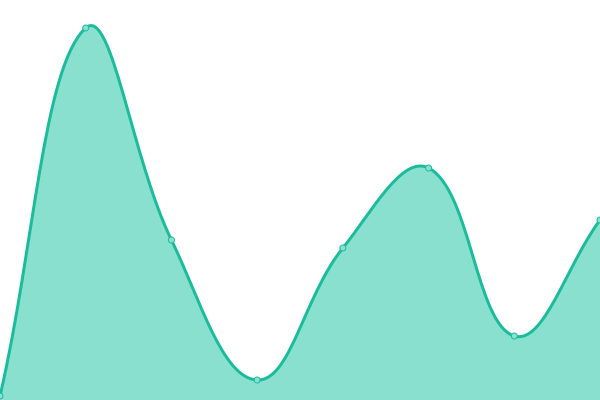
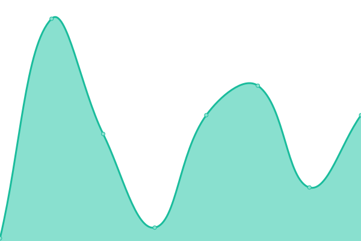

# [📈 Live Status](https://dev.status.ops.neta.mx): <!--live status--> **🟧 Partial outage**

This repository contains the open-source uptime monitor and status page for [Neta](https://neta.mx/), powered by [Upptime](https://github.com/upptime/upptime).

With [Upptime](https://upptime.js.org), you can get your own unlimited and free uptime monitor and status page, powered entirely by a GitHub repository. We use [Issues](https://github.com/NetaMx/upptime/issues) as incident reports, [Actions](https://github.com/NetaMx/upptime/actions) as uptime monitors, and [Pages](https://dev.status.ops.neta.mx) for the status page.

<!--start: status pages-->
<!-- This summary is generated by Upptime (https://github.com/upptime/upptime) -->
<!-- Do not edit this manually, your changes will be overwritten -->
<!-- prettier-ignore -->
| URL | Status | History | Response Time | Uptime |
| --- | ------ | ------- | ------------- | ------ |
|  NetaMx Site | 🟥 Down | [neta-mx-site.yml](https://github.com/NetaMx/upptime-dev/commits/HEAD/history/neta-mx-site.yml) | 

 0ms
     
 | 

<a href="https://dev.status.ops.neta.mx/history/neta-mx-site">0.03%</a>
    

|  Mi Tienda | 🟥 Down | [mi-tienda.yml](https://github.com/NetaMx/upptime-dev/commits/HEAD/history/mi-tienda.yml) | 

 0ms
     
 | 

<a href="https://dev.status.ops.neta.mx/history/mi-tienda">0.03%</a>
    

|  Rutas Neta | 🟩 Up | [rutas-neta.yml](https://github.com/NetaMx/upptime-dev/commits/HEAD/history/rutas-neta.yml) | 

 271ms
     
 | 

<a href="https://dev.status.ops.neta.mx/history/rutas-neta">65.50%</a>
    

|  Admin ops | 🟩 Up | [admin-ops.yml](https://github.com/NetaMx/upptime-dev/commits/HEAD/history/admin-ops.yml) | 

 252ms
     
 | 

<a href="https://dev.status.ops.neta.mx/history/admin-ops">65.48%</a>
    

|  neta argo | 🟩 Up | [neta-argo.yml](https://github.com/NetaMx/upptime-dev/commits/HEAD/history/neta-argo.yml) | 

 143ms
     
 | 

<a href="https://dev.status.ops.neta.mx/history/neta-argo">0.26%</a>
    

|  ops warehouse | 🟥 Down | [ops-warehouse.yml](https://github.com/NetaMx/upptime-dev/commits/HEAD/history/ops-warehouse.yml) | 

 257ms
     
 | 

<a href="https://dev.status.ops.neta.mx/history/ops-warehouse">0.03%</a>
    

|  fraud detection | 🟩 Up | [fraud-detection.yml](https://github.com/NetaMx/upptime-dev/commits/HEAD/history/fraud-detection.yml) | 

 39ms
     
 | 

<a href="https://dev.status.ops.neta.mx/history/fraud-detection">47.40%</a>
    

|  category | 🟩 Up | [category.yml](https://github.com/NetaMx/upptime-dev/commits/HEAD/history/category.yml) | 

 31ms
     
 | 

<a href="https://dev.status.ops.neta.mx/history/category">10.29%</a>
    

|  notification | 🟩 Up | [notification.yml](https://github.com/NetaMx/upptime-dev/commits/HEAD/history/notification.yml) | 

 38ms
     
 | 

<a href="https://dev.status.ops.neta.mx/history/notification">10.27%</a>
    

|  core api | 🟩 Up | [core-api.yml](https://github.com/NetaMx/upptime-dev/commits/HEAD/history/core-api.yml) | 

 46ms
     
 | 

<a href="https://dev.status.ops.neta.mx/history/core-api">10.22%</a>
    

|  ordenes | 🟩 Up | [ordenes.yml](https://github.com/NetaMx/upptime-dev/commits/HEAD/history/ordenes.yml) | 

 42ms
     
 | 

<a href="https://dev.status.ops.neta.mx/history/ordenes">10.13%</a>
    

|  discount | 🟩 Up | [discount.yml](https://github.com/NetaMx/upptime-dev/commits/HEAD/history/discount.yml) | 

 37ms
     
 | 

<a href="https://dev.status.ops.neta.mx/history/discount">10.15%</a>
    

|  popup | 🟩 Up | [popup.yml](https://github.com/NetaMx/upptime-dev/commits/HEAD/history/popup.yml) | 

 44ms
     
 | 

<a href="https://dev.status.ops.neta.mx/history/popup">10.09%</a>
    

|  product | 🟩 Up | [product.yml](https://github.com/NetaMx/upptime-dev/commits/HEAD/history/product.yml) | 

 40ms
     
 | 

<a href="https://dev.status.ops.neta.mx/history/product">10.04%</a>
    

|  promo | 🟩 Up | [promo.yml](https://github.com/NetaMx/upptime-dev/commits/HEAD/history/promo.yml) | 

 43ms
     
 | 

<a href="https://dev.status.ops.neta.mx/history/promo">10.03%</a>
    

|  security | 🟥 Down | [security.yml](https://github.com/NetaMx/upptime-dev/commits/HEAD/history/security.yml) | 

 0ms
     
 | 

<a href="https://dev.status.ops.neta.mx/history/security">0.01%</a>
    

|  payments | 🟩 Up | [payments.yml](https://github.com/NetaMx/upptime-dev/commits/HEAD/history/payments.yml) | 

 37ms
     
 | 

<a href="https://dev.status.ops.neta.mx/history/payments">9.99%</a>
    

|  challenge | 🟥 Down | [challenge.yml](https://github.com/NetaMx/upptime-dev/commits/HEAD/history/challenge.yml) | 

 26ms
     
 | 

<a href="https://dev.status.ops.neta.mx/history/challenge">0.03%</a>
    

|  rengoku | 🟩 Up | [rengoku.yml](https://github.com/NetaMx/upptime-dev/commits/HEAD/history/rengoku.yml) | 

 42ms
     
 | 

<a href="https://dev.status.ops.neta.mx/history/rengoku">9.91%</a>
    

|  ops store | 🟩 Up | [ops-store.yml](https://github.com/NetaMx/upptime-dev/commits/HEAD/history/ops-store.yml) | 

 34ms
     
 | 

<a href="https://dev.status.ops.neta.mx/history/ops-store">9.86%</a>
    

<!--end: status pages-->

[**Visit our status website →**](https://dev.status.ops.neta.mx)

## 📄 License

- Powered by: [Upptime](https://github.com/upptime/upptime)
- Code: [MIT](./LICENSE) © [Neta](https://neta.mx/)
- Data in the `./history` directory: [Open Database License](https://opendatacommons.org/licenses/odbl/1-0/)
